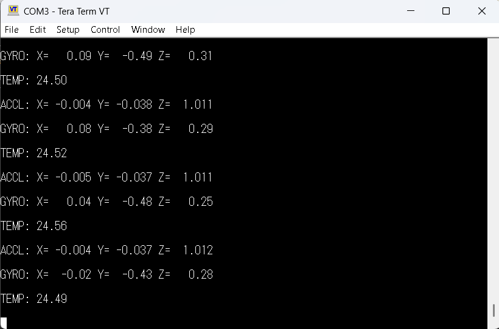

# STM32 ISM330DHCX Bring-up

Professional bring-up of the **ST ISM330DHCX 6-axis IMU** on the **STM32 Nucleo-F446RE** using the **official ST sensor driver**.

This project focuses on clean firmware architecture, modular driver design, and production-style embedded development rather than a tutorial implementation.

---

# Hardware

- STM32 Nucleo-F446RE
- ISM330DHCX 6-Axis IMU
- STM32CubeIDE
- ST HAL Driver
- Official ST ISM330DHCX Driver

---

# Images

## Hardware Setup


## UART Output



---

# Features

- ✅ I2C Communication
- ✅ WHO_AM_I Device Verification
- ✅ Register Read
- ✅ Register Write
- ✅ Accelerometer Configuration
- ✅ Accelerometer Data Acquisition
- ✅ Gyroscope Configuration
- ✅ Gyroscope Data Acquisition
- ✅ Temperature Sensor Reading
- ✅ Physical Unit Conversion (g, dps, °C)
- ✅ Modular Driver Architecture
- ✅ Error Handling
- ✅ Git Version Control

---

### SSD1306 OLED

- ✅ SSD1306 Controller Initialization
- ✅ 128×64 I2C OLED Support
- ✅ 1024-byte Framebuffer
- ✅ Pixel-level Rendering
- ✅ Boundary Validation
- ✅ Page-addressed Screen Updates
- ✅ I2C Command/Data Transactions using STM32 HAL
- ✅ Hardware-validated Four-corner Pixel Test

---


# Project Architecture

The project follows a layered architecture where application logic is separated from peripheral drivers and hardware abstraction.


                    Application
                         │
                         ▼
              Peripheral Drivers
          ┌──────────────┴──────────────┐
          │                             │
          ▼                             ▼
   ISM330DHCX Driver             SSD1306 Driver
          │                             │
          ▼                             ▼
 Official ST Driver                 I2C / HAL
          │                             │
          └──────────────┬──────────────┘
                         │
                         ▼
                    STM32 HAL
                         │
                         ▼
                  STM32F446RE MCU
                  
```

---

# Folder Structure

```
Core/
│
├── Inc/
│   ├── imu.h
│   ├── ssd1306.h
│   └── ...
│
├── Src/
│   ├── imu.c
│   ├── ssd1306.c
│   ├── main.c
│   └── ...
│
Drivers/
│
├── ISM330DHCX/
│
└── STM32F4xx_HAL_Driver/
│
docs/
│
├── hardware_setup.jpeg
└── uart_output.png

```

---

# Hardware Connections

| ISM330DHCX | STM32F446RE |
|------------|-------------|
| SDA | PB9 (I2C1 SDA) |
| SCL | PB8 (I2C1 SCL) |
| 3V3 | 3.3V |
| GND | GND |

Communication Interface:

- I2C
- 7-bit Address: 0x6B

---

# Driver API

```c
ISM330DHCX:

int32_t IMU_Init(I2C_HandleTypeDef *hi2c);

int32_t IMU_ReadAccel(float *ax,
                      float *ay,
                      float *az);

int32_t IMU_ReadGyro(float *gx,
                     float *gy,
                     float *gz);

int32_t IMU_ReadTemperature(float *temperature);

```

```

SSD1306:

The OLED driver provides initialization, framebuffer manipulation, pixel rendering, and screen update functionality.

Example API structure:

bool SSD1306_Init(I2C_HandleTypeDef *hi2c);

void SSD1306_Clear(void);

void SSD1306_DrawPixel(uint8_t x,
                       uint8_t y,
                       uint8_t color);

bool SSD1306_UpdateScreen(void);

```
---

#SSD1306 OLED Driver:

The SSD1306 driver was implemented as a framebuffer-based graphics driver for a 128×64 I2C OLED display.

The display requires:

128 × 64 pixels
        ↓
128 × 64 / 8
        ↓
1024 bytes framebuffer

The framebuffer allows the application to modify individual pixels in memory before transferring the complete display state to the OLED.

Implementation
Datasheet-based SSD1306 controller initialization
1024-byte framebuffer
Pixel-level rendering
Coordinate boundary validation
Page-addressed display updates
I2C command and data transactions through STM32 HAL
Hardware validation using a four-corner pixel test
Display Memory Model

The 128×64 display is organized into 8 pages, with each page containing 8 vertical pixels.

128 columns
┌─────────────────────────────────────────────┐
│ Page 0                                      │
├─────────────────────────────────────────────┤
│ Page 1                                      │
├─────────────────────────────────────────────┤
│ Page 2                                      │
├─────────────────────────────────────────────┤
│ Page 3                                      │
├─────────────────────────────────────────────┤
│ Page 4                                      │
├─────────────────────────────────────────────┤
│ Page 5                                      │
├─────────────────────────────────────────────┤
│ Page 6                                      │
├─────────────────────────────────────────────┤
│ Page 7                                      │
└─────────────────────────────────────────────┘
                  64 rows

The driver converts framebuffer contents into page-addressed I2C transfers during screen updates.

---

---

# Example UART Output

```
Acc: X=-0.003  Y=-0.034  Z=1.012 g

Gyr: X=0.07  Y=-0.46  Z=0.29 dps

Temperature: 24.84 °C
```

---

# Development Process

The project is being developed incrementally through small, testable peripheral bring-up milestones.

-Completed
-Project Setup
-UART Communication
-I2C Configuration
-ISM330DHCX WHO_AM_I Verification
-ISM330DHCX Register Read/Write
-Accelerometer Driver
-Gyroscope Driver
-Temperature Driver
-Physical Unit Conversion
-ISM330DHCX Bring-up Completion
-SSD1306 Driver Development
-SSD1306 Controller Initialization
-OLED Framebuffer Implementation
-Pixel-level Rendering
-Boundary Validation
-Page-addressed Display Updates
-OLED Hardware Validation

Each milestone is developed and committed independently using Git.

-In Progress / Planned
-SD Card Peripheral Bring-up
-Timer-based Sampling
-Ring Buffer
-Binary Data Logger
-SD Card Storage
-UART Command Line Interface
-DMA Support
-Interrupt-driven Data Acquisition
-Sensor Fusion
-Python Visualization Tool

---

# Design Goals

This project focuses on developing practical embedded firmware skills through real hardware rather than relying solely on generated or tutorial implementations.

Key design goals include:

-Clean Embedded C
-Modular driver design
-Hardware abstraction
-Separation of application and driver layers
-Reusable peripheral interfaces
-Datasheet-driven development
-Proper error handling
-Hardware validation
-No modification of STM32 HAL
-No modification of the official ST sensor driver
-Incremental Git-based development
-Debuggable and maintainable firmware architecture

---

# Future Improvements

Planned improvements include:

- OLED Dashboard
- Timer-based Sampling
- Ring Buffer
- Binary Data Logger
- SD Card Storage
- UART Command Line Interface
- DMA Support
- Interrupt-driven Data Acquisition
- Sensor Fusion
- Python Visualization Tool

---

# Learning Objectives

This project was built to gain practical experience with:

- Embedded C
- STM32 HAL
- STM32CubeIDE
- I2C Communication
- MEMS Sensors
- Driver Development
- Firmware Architecture
- Git & GitHub
- Embedded Debugging

---

# Repository Status

Current Version:

**IMU Bring-up Complete ✅**
**OLE Bring-up Complete ✅**

Next milestone:

**MicroSD card**

---

# License

This project is provided for educational and portfolio purposes.
